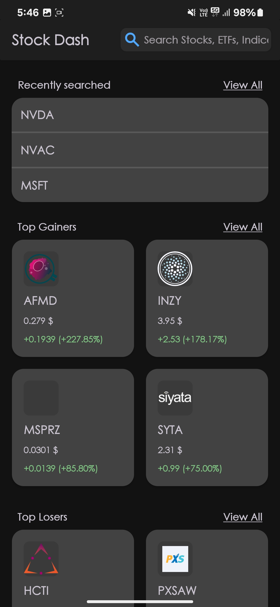
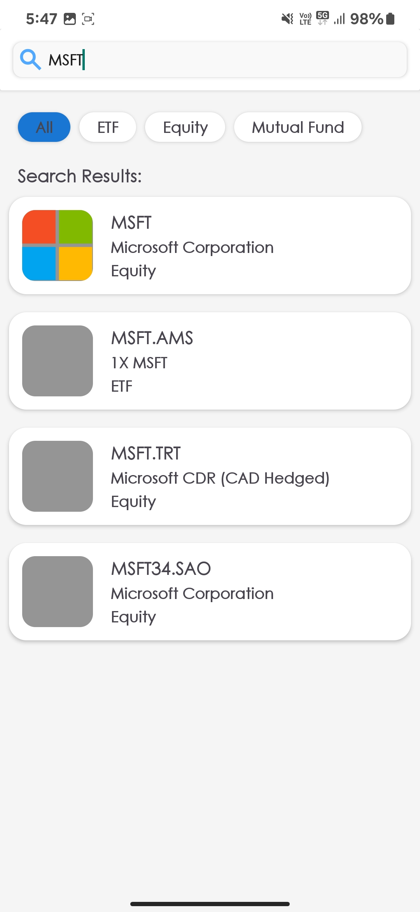
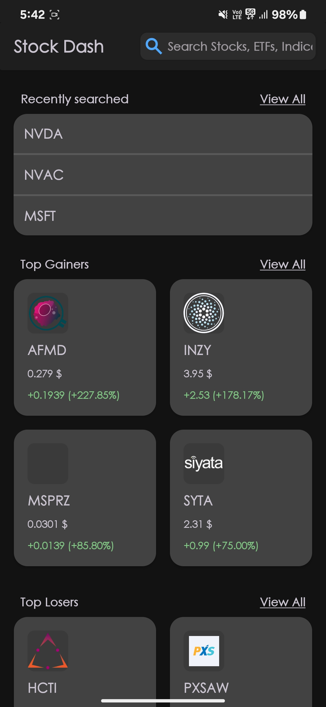
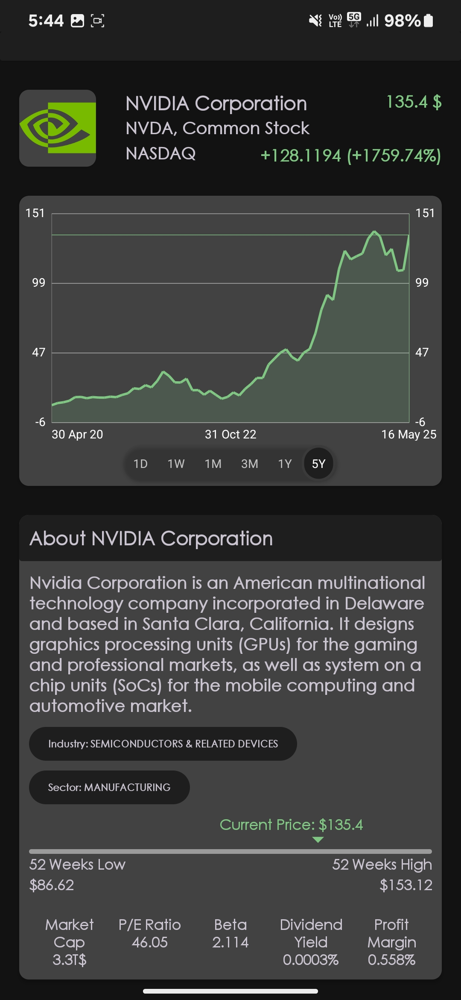

# StockDash - Android Stock Explorer

StockDash is a Kotlin-based Android app that provides a clean interface for exploring stock and ETF data. Users can discover trending stocks, search for specific tickers, and view detailed information with price charts. This project emphasizes clean architecture and modern Android development practices.

## Core Features

*   **Explore:** See recently searched items, top US market gainers, losers, and most actively traded stocks.
*   **Search:** Find stocks/ETFs by name or ticker with filter options (All, Stocks, ETFs, etc.). Displays recent searches.
*   **Stock Details:** View company overviews, key stats, and an interactive price chart with selectable time ranges (1D to 5Y). Includes a 52-week range indicator.
*   **View All Lists:** See the complete list for sections like "Top Gainers" from the Explore screen.
*   **Dynamic Theming:** Switch between Light and Dark modes within the app.
*   **Data Handling:** Implements loading states, error messages, and daily caching of API data to improve performance and reduce API calls.

## Tech Stack & Architecture

*   **Language:** Kotlin
*   **Architecture:** MVVM (View - ViewModel - Model/Repository)
*   **Async:** Kotlin Coroutines & Flow
*   **DI:** Hilt
*   **Networking:** Retrofit, OkHttp, Moshi (for Alpha Vantage API)
*   **Database:** Room (for caching and recent searches)
*   **UI:** XML with ViewBinding, Material Components, RecyclerView
*   **Charting:** MPAndroidChart
*   **Image Loading:** Coil (for stock logos via FinancialModelingPrep API)
*   **Loading States:** Shimmer (Facebook)

## Setup

1.  **API Keys:**
    *   This app uses the [Alpha Vantage API](https://www.alphavantage.co/support/#api-key) for primary stock data.
    *   Create a `local.properties` file in the project root.
    *   Add your keys:
        ```properties
        ALPHA_VANTAGE_API_KEY="YOUR_ALPHA_VANTAGE_KEY"
        ```
2.  **Build:** Open in Android Studio, let Gradle sync, then build.

## App Structure Overview

*   **`data` package:** Handles all data sources (network DTOs, Room entities, domain models, repository, API service).
    *   **Caching:** API data for explore, stock details, and charts is cached daily. Recent searches are persisted.
*   **`di` package:** Hilt modules for dependency injection (Network, Database, Repository).
*   **`ui` package:** Contains Fragments (Explore, Search, Product Detail, View All, Settings), ViewModels (MainViewModel, ExploreViewModel, ProductViewModel), and Adapters.
    *   **`MainViewModel`:** Activity-scoped, manages search state, recent searches, and shared UI state for `MainActivity`.
    *   Screen-specific ViewModels handle their respective screen's logic.
*   **`util` package:** Contains helpers like `Resource.kt` and theme utility functions.

*   Getting around StockDash is pretty straightforward. You'll start on the Explore screen, which is your main dashboard for discovering what's hot in the market and quickly revisiting stocks you've looked at recently. If you have a particular stock or ETF in mind, the search bar (usually at the top of the screen) is your go-to. Tapping it slides open the Search screen, where you can type your query, see suggestions, and browse your search history. Found a stock you like on any screen? A simple tap on it opens up the Product Detail screen, packed with all the nitty-gritty details and price charts. And if those "Top Gainers" or "Top Losers" lists on the Explore screen catch your eye, just hit the "View All" button next to them to see the full rundown

## Key Logic Points

*   **MVVM:** Separates UI (Fragments) from business logic and state (ViewModels) and data operations (Repository).
*   **Repository Pattern:** Single source of truth for data, abstracting network and local data sources.
*   **StateFlow:** Used in ViewModels to expose UI state reactively to Fragments.
*   **Daily Caching:** Reduces API calls by storing data fetched from Alpha Vantage in a local Room database, refreshing once per day.
*   **Dynamic Theming:** Uses Android's theme attributes and `AppCompatDelegate` to allow users to select Light/Dark modes independently of the system. Colors are defined in `colors.xml` and mapped to theme attributes in `themes.xml` (and `themes-night/xml`).

## Screenshots / Demo







## Implemented Extras (Brownie Points)

*   Dynamic Light/Dark theme switching.
*   Search result filtering (All, Stocks, ETFs).
*   Shimmer loading effects.
*   52-week range indicator and interactive chart marker on the Product Detail screen.
*   Stock logos (via FinancialModelingPrep).

## Known Limitations / Future Work

*   Alpha Vantage free tier has strict rate limits; app relies heavily on caching.
*   Pagination for "View All" is designed but not fully implemented as current API endpoints return complete (but limited) lists.
*   Chart X-axis label formatting is basic.
